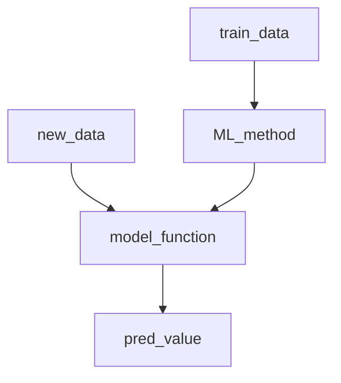

# 智能计算系统学习笔记——Chapter 2神经网络基础

## 机器学习到深度学习

### What does Machine Learning do?

* 通过经验自动改进计算机算法
* 减少损失函数

### Perceptron Model

#### Divider

* 目标:找到合适的$\omega,b$在$H(x)=sign(\omega^Tx+b)$的感知机模型下将线性可分的数据集分成两类
* 损失函数:误分类点组成的数据集M，应该与超平面的总距离尽量小$d=\frac{1}{||\omega||_2}|\omega^Tx_j+b|$

#### 损失函数极小化——随机梯度下降

* $\nabla_{\omega}L(\omega,b)=-\sum_{x_j\in M}y_jx_j,\omega=\omega+\alpha y_jx_j$
* $\nabla_bL(\omega,b)=-\sum_{x_j\in M}y_j ,b=b+\alpha y_j$

随机选择误分类点$(x_j,y_j)$对$\omega,b$进行$\alpha$为步长的更新，通过迭代是损失函数逐步趋向于0

## Neutral Network

### Training

目标：输出和预期输出尽量一致

* 正向传播：根据输入计算输出
* 反向传播：根据输出计算损失函数，利用链式求导计算梯度优化网络

### Back Propaganda

考虑一个输入维度为3，含有一个隐层且隐层维度为3，输出维度为2的神经网络。两层参数分别为$b_1,W_1,b_2,W_2$，输入输出为$x_1,x_2,x_3,y_1,y_2$，实际输出为$\hat{y_1},\hat{y_2}$，损失函数采用MSE
$$
L(W)=\frac{1}{2}\sum_{i=1}^2 (y_i-\hat{y_i})^2
$$
反向传播将神经网络输出误差反向传播到神经网络输入端，由此来更新神经网络中各个连接的权重

### Design principle of Neutral Network

#### How to optimize performance of Network

* 调整网络拓扑结构
* 选择合适的激活函数
* 选择合适的损失函数

#### MSE and `crossentropy`

##### MSE

$L=\frac{1}{2}(y-\hat{y})^2$，假设$\hat{y}=\sigma(z),z=\omega x+b$，then
$$
\frac{\partial L}{\partial \omega}=\frac{\partial L}{\partial\hat{y}}\frac{\partial \hat{y}}{\partial z}\frac{\partial z}{\partial \omega}\\
\frac{\partial \hat{y}}{\partial z}=\sigma'(z)=(1-\sigma(z))\sigma(z)\\
\frac{\partial L}{\partial \hat{y}}=(y-\hat{y})\\
\frac{\partial z}{\partial \omega}=x
$$
梯度中包含$\sigma'(z)$，输出接近于1，导致梯度消失，神经网络反向传播参数更新缓慢，学习效率下降

##### `crossentroy`

克服使用sigmoid函数导致的均方差损失函数参数更新缓慢的问题$\hat{y}$为模型预测值，y为测试数据实际标签
$$
L=-\frac{1}{m}\sum_{x\in D}\sum_i y_i\ln(\hat{y_i})\\ 
对于二分类\quad L=-\frac{1}{m}\sum_{x\in D}(y\ln {\hat{y}}+(1-y)\ln(1-\hat{y}))
$$

#### Activate function

激活函数需要具备的性质

1. 可微性：优化方法基于梯度
2. 输出值和范围：激活函数的值域在一个有限的范围内，则基于梯度的优化方法更加稳定，特征的表示受有限权限的影响更显著。激活函数输出是无限时，模型训练更加高效，需要更小的学习率

##### sigmoid

$$
\sigma(x)=\frac{1}{1+e^{-x}}
$$

* 将输入投影到(0,1)区间内
* 非0均值，导致梯度始终为正
* 计算指数需要泰勒展开，较慢
* 梯度消失

#####  tanh

$$
tanh(x)=\frac{sinh(x)}{cosh(x)}=\frac{e^x-e^{-x}}{e^x+e^{-x}}=2\times sigmoid(2x)-1
$$

* 0均值
* 输入很大或者很小，输出平滑，梯度小不利于更新

##### ReLU

$$
ReLU(x)=max(0,x)
$$

* x>0保持梯度不衰减，缓解梯度消失
* 学习率很大导致反向传播参数为负数，导致ReLU**死掉**

##### ELU

$$
ELU(x)=\left\{
\begin{aligned}
x,x> 0\\
\alpha(e^x-1),x\leq 0
\end{aligned}
\right.
$$

* $\alpha$是可调参数，控制在负值区间内衰减的速度
* ELU输出均值接近为0，收敛速度较快
* 右侧先行部分使得ELU可以缓解梯度消失，左侧软饱和让ELU对输出变化或噪声更鲁棒

### 欠拟合和过拟合

神经网络规模加大，导致挖掘的特征过多，模型在训练数据上表现很好但是在测试数据上表现不佳

解决过拟合：正则化，对于多项式拟合$f(x)=\sum_{i=1}^n\omega_i x_i^i,L(\omega)=\frac{1}{2n}\sum_{i=1}^n ||y_i-\hat{y_i}||^2$

在损失函数中增加一个惩罚项$\Omega(\omega)$，正则化损失函数为$\hat{L(\omega)}=L(\omega)+\Omega(\omega)$

#### $L^2$正则化

* 正则化项$\Omega(\omega)=\frac{1}{2}\parallel \omega\parallel_2^2$
* 目标函数$\hat{L(\omega;X,y)}=L(\omega;X,y)+\frac{\theta}{2}\parallel \omega\parallel_2^2$
* 正则化梯度计算$\nabla_\omega\hat{L(\omega)}=\nabla_\omega L(\omega)+{\theta}\omega$
* 梯度更新$\omega=\omega-\eta(\nabla_\omega L(\omega)+{\theta}\omega)=(1-\eta \theta)\omega-\eta\nabla_\omega L(\omega)$

#### $L^1$正则化

* 正则化项$\Omega(\omega)=\parallel \omega \parallel_1=\sum_i |\omega_i|$
* 梯度$\nabla_\omega \hat{L(\omega)}=\nabla_\omega L(\omega)+\theta sign(\omega)$
* 引入符号函数，使得网络中的权重接近于0，减少网络复杂度，防止过拟合

### Bagging集成

* 训练不同的模型，目标函数，训练算法可以相同
* 不同模型共同决定输出
* 原始数据集重复采样获取，数据集大小和原始数据集保持一致——单个数据集重复多次

### 交叉验证

* 数据集中每个样本在单次训练中，要么作为测试集或训练集，不能同时作为训练&&测试
* 交叉验证给了每个样本作为测试机和训练集的机会，保证鲁棒性

#### K-折交叉验证

* 数据集S分为k′
* 每次取一份作为测试集，用其它k-1训练模型，计算模型在测试集上的$MSE_i$，取平均

$$
MSE=\frac{1}{k}\sum_{i=1}^k MSE_i
$$

